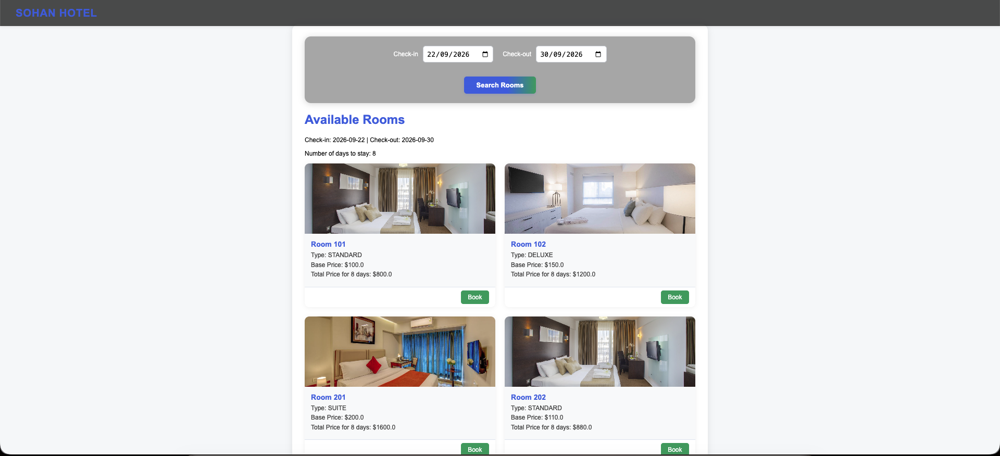
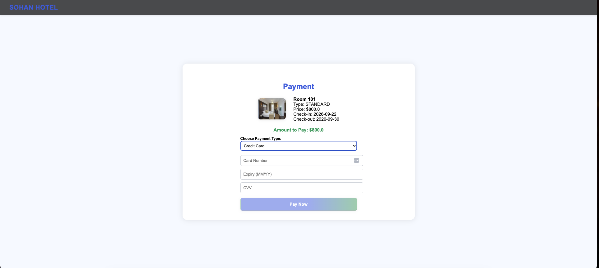
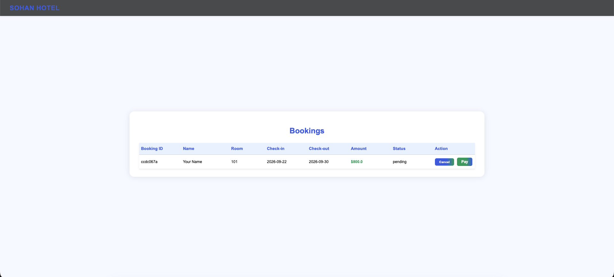

# Hotel Reservation System

A web application for booking hotels, built with Spring Boot, Spring MVC, Spring Data JPA and Thymeleaf, using an embedded H2 database.

## Features

- Browse / search hotels and rooms
- Book a room by selecting dates and entering customer details
- View, update or cancel reservations
- Billing / total price calculation
- Input validation and error handling

## Tech Stack

| Layer | Technology | Purpose |
|-------|-----------|---------|
| **Language** | Java 17 | Core programming language |
| **Framework** | Spring Boot 3.5.6 | Application setup and dependency injection |
| **Web** | Spring MVC (spring-boot-starter-web) | Controllers and request handling |
| **View** | Thymeleaf | Server-side rendered HTML pages |
| **Data Access** | Spring Data JPA (Hibernate) | Object-relational mapping and repositories |
| **Database** | H2 (embedded) | Lightweight relational database for development |
| **Build Tool** | Gradle (Kotlin DSL) | Dependency management and builds |

## How It Works

1. A user opens a page in the browser, and the request goes to a Spring MVC **controller**.
2. The controller calls the service layer to apply the booking logic.
3. **Spring Data JPA repositories** read and write Hotel, Room, Customer, Booking entities in the H2 database.
4. The result is passed to a **Thymeleaf template**, which renders the HTML page.

## Getting Started

### Prerequisites
- Java 17 or higher
- Git

### Run the application

```bash
# Clone the repository
git clone https://github.com/sulekha4s/hotel-reservation-system.git
cd hotel-reservation-system

# Run with the Gradle wrapper (no separate Gradle install needed)
./gradlew bootRun        # On Windows: gradlew.bat bootRun
```

Then open **http://localhost:8080** in your browser.

## Project Structure

```
hotel-reservation-system/
├── src/
│   ├── main/
│   │   ├── java/        # [controllers, services, repositories, entities]
│   │   └── resources/   # [Thymeleaf templates, application.properties]
├── build.gradle.kts     # Dependencies and build configuration
├── settings.gradle.kts
└── gradlew              # Gradle wrapper
```

## Screenshots





